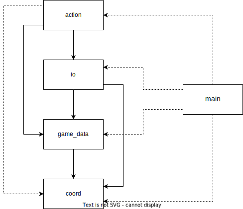

# Dépendences

- [Bilbiothèque MLV](http://www-igm.univ-mlv.fr/~boussica/mlv/index.html)

# Documentation utilisateur

## Démarrer le jeu

1. Lancez la commande `make` pour générer `taquin.out`.
2. Executez `bin/taquin.out` pour jouer.
3. Quand vous avez fini, lancez la commande `make clean` pour effacer `taquin.out` et les fichiers objet.

## Déroulement du jeu

1. Regardez l'image originale.
2. Appuyez sur une touche.
3. L'image est mélangée, à vous de la reconstituer !
4. Déplacez les cases du puzzle avec la souris ou les touches directionnelles. Ou bien quittez le jeu avec Q ou Echap.
5. Si vous finissez le puzzle, le jeu se met en pause pour vous féliciter.
6. Appuyez sur une touche pour quitter.

## Controles

| Action            | Touche
| ----------------- | ------
| Quitter le jeu    | Echap
| Quitter le jeu    | Q
| Déplacer une case | Touches directionnelles
| Déplacer une case | Boutons de la souris

# Documentation technique

## Modules

Voici la liste des modules écrits :

| Nom       | Role
| --------- | ----
| coord     | Simplifier le code des autres modules
| game_data | Donner des informations sur l'état actuel du jeu
| io        | Récupérer les entrées du joueur et afficher la fenêtre de jeu
| action    | Modifier l'état du puzzle
| main      | Initialiser les différents objets, boucle principale du jeu

Voici le graphe d'inclusions du projet (les flèches en pointillés signifient que l'inclusion est faite dans le fichier source) :

## Structures de données

Voici la liste des structures de données définies :

| Nom       | Définie dans | Représente                    | Type
| --------- | ------------ | ----------------------------- | ----
| Coord     | coord        | Un emplacement dans le puzzle | struct
| Board     | game_data    | Le puzzle                     | struct
| InputData | io           | Une entrée de l'utilisateur   | struct
| Task      | io           | Une action à effectuer        | struct
| TaskType  | io           | Type d'une action à effectuer | enum

### 1. Coord

| Contenu      | Description
| ------------ | -----------
| lin          | coordonée verticale
| col          | coordonée horizontale

### 2. Board

| Contenu      | Description
| ------------ | -----------
| cells        | tableau contenant les cases du puzzle, chaque case contient sa position initiale
| empty        | position de la case vide dans le puzzle

### 3. InputData

| Contenu      | Description
| ------------ | -----------
| event        | clavier ou souris
| key          | quelle touche du clavier
| mouse_button | quel bouton de la souris
| state        | enfoncé ou relaché

### 4. Task

| Contenu      | Description
| ------------ | -----------
| type         | type d'action
| coord        | emplacement dans le puzzle

### 5. TaskType

| Contenu      | Description
| ------------ | -----------
| PASS         | ne rien faire
| QUIT         | quitter le jeu
| MOVE_ABS     | déplacer une case en utilisant les coordonnées (absolues)
| MOVE_REL     | déplacer une case en utilisant les coordonnées (relatives à la position de la case vide)
